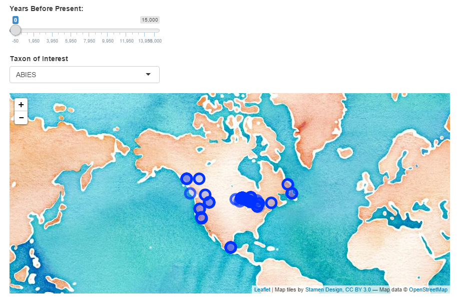

# Tutorial - Using Shiny & Leaflet to Explore Spatial Datasets

By: [Simon Goring](http://github.com/SimonGoring)
Date: March 7, 2016

A tutorial to test out some ideas for a Shiny/Leaflet interaction.  This tutorial will be presented as part of the UBC Mozilla [R Study Group] (https://github.com/minisciencegirl/studyGroup).

The intent is to help you get started using both [leaflet](https://rstudio.github.io/leaflet/) and [Shiny](http://shiny.rstudio.com/) together in R to do basic data exploration with geospatial data.  The tutorial assumes you have some experience in R, but takes a "plug & play" approach - copy the code as is, and then play around with it.  Even a beginner should be able to get this code to work.

In this tutorial you will:

1. Learn briefly about leaflet & shiny
2. Install the leaflet and Shiny packages
3. Produce a very basic leaflet map and learn some elementary functions
4. Download a file from GitHub
5. Build a simply Shiny app with a slider bar and drop down menu
6. Explore a dataset.

I've tried to structure the main document to be a 'chatty' tutorial, so you can walk through things on your own, but ultimately we only get so far in developing the tutorial because the workshop session is only one hour long.

Using RStudio you can fork (or clone) the repository locally and then "run" it using rmarkdown.  If you do that you will have an html document wth embedded Shiny'Leaflet applets.  It's pretty cool.  It does run from the web, but my current hosting situation isn't great.

At the end, you'll make a nice little map like the one below, of data from the [Neotoma Paleoecological Database](http://neotomadb.org), but the lesson is broadly applicable.  I just know this data best.

## Contribution

You are welcome to fork & contribute to this repository, but contributors are expected to follow the [Code of Conduct](http://github.com/SimonGoring/ShinyLeaflet-tutorial/code_of_conduct.md) posted in this repository.
